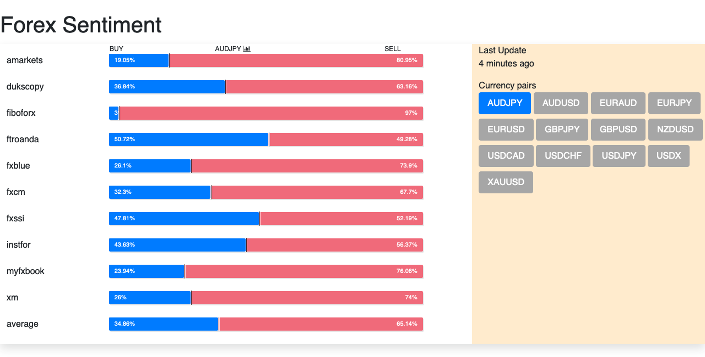

# Sistem
project API FOREX

## Sistem API FOREX


### Installation
1. Clone the repository using the command "git clone [link]"
2. Create database in MySql
3. Configure the .env file accordingly
4. Run command 

```
$composer install
$php artisan migrate
$php artisan db:seed
$php artisan serve
$php artisan storage:link
```
### refresh migrate
```
$php artisan migrate:fresh --seed
```


* demo

